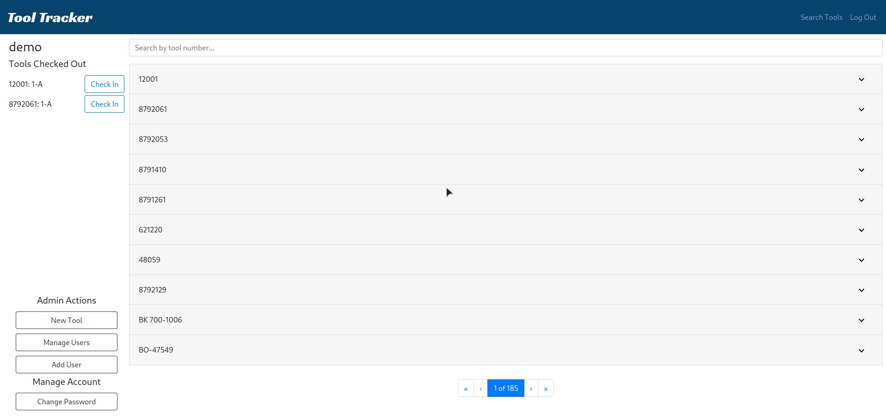

# Tool-Tracker

Inventory tracker for equipment and tools. This was built as a large inventory management system for an automotive repair facility.

## Technology

- Frontend

  - React
  - Bootstrap
  - Styled Components

- Backend
  - NodeJS
  - Mongoose/MongoDB
  - Express
  - Auth w/ JSON Web Tokens

## Features

- Permissions and roles
- Encrypted user database
- Edit, add, and delete inventory and users
- Inventory fuzzy search
- Item check in/out system

## Demo

[Try it out!](https://j-tool-tracker.netlify.app)
username: user  
password: password

